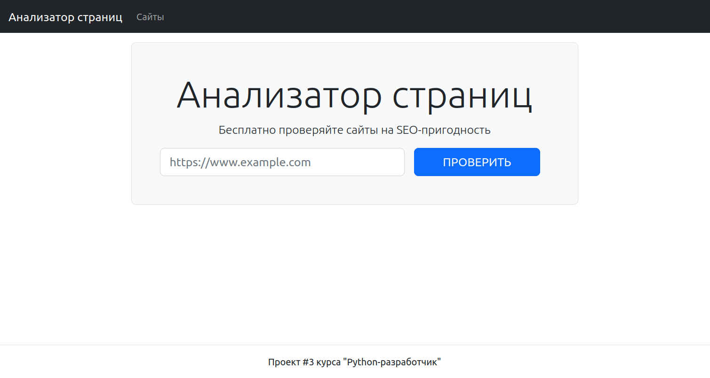
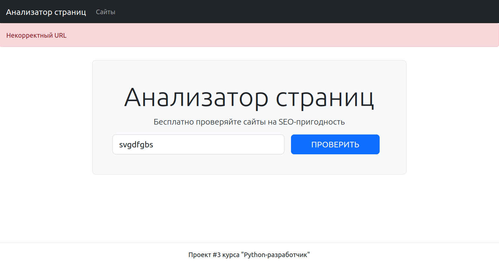
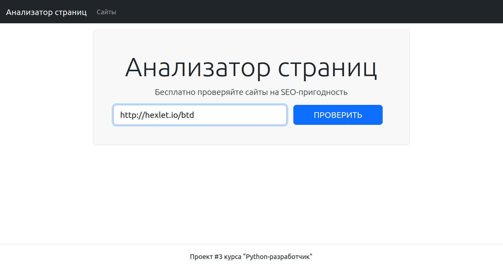
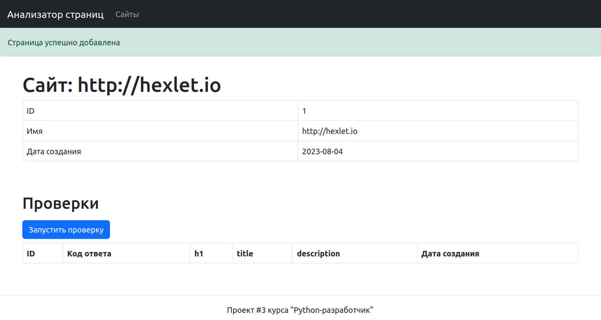
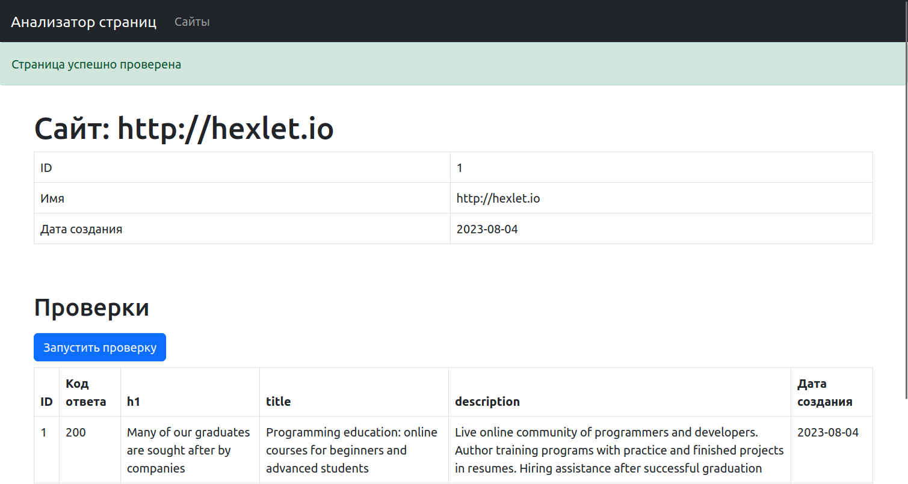
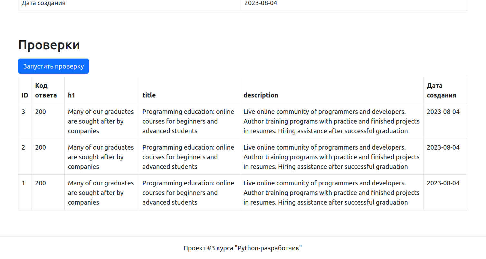
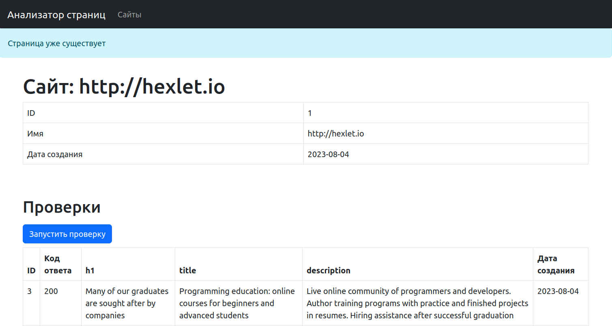
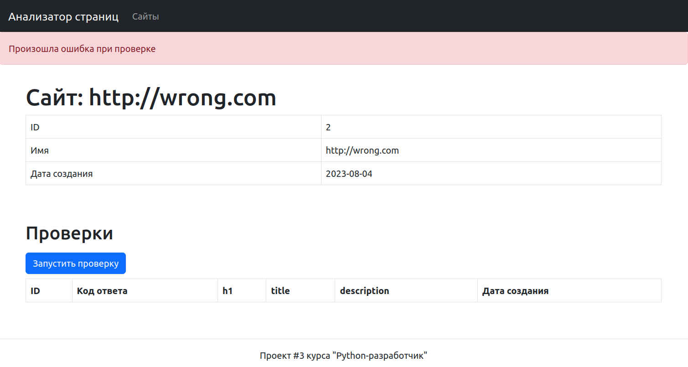
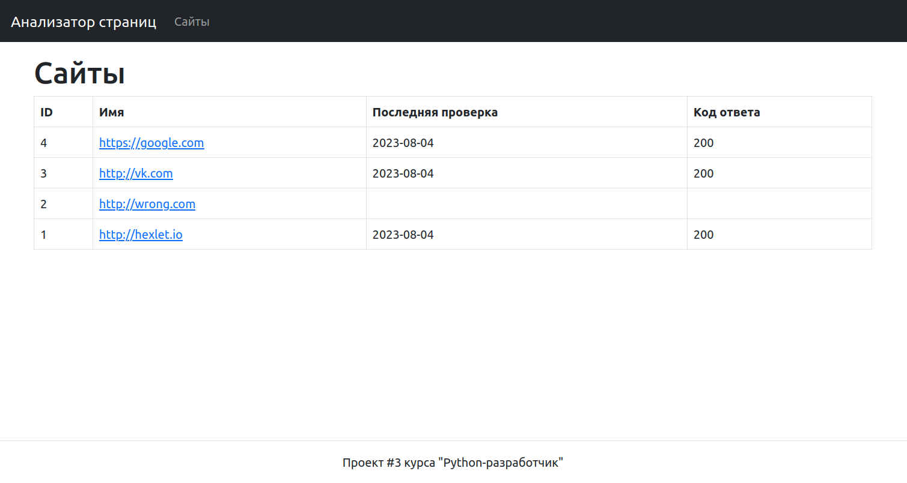

   

---

#### This is my educational project #3 on the [Hexlet platform](https://hexlet.io) (speciality: Python developer).  
#### It represents Page Analyzer - simple site with Flask backend (using PostgreSQL database) and Bootstrap frontend
#### Application allows to test any site for main SEO attributes (h1, title, description) and saves test-results to database
---
### :fire: [Working application try here](https://page-analyser.onrender.com) :fire:
---
#### :camera: some example pics below :camera:
#### Main page with post-form for URL:

#### URL validation with flash message:

#### URL normalization after form submit:

#### URL adding to PostgreSQL database (with plash message):

#### Each added URL is able to check for SEO-attributes (with flash message):

#### For each URL is able to SEO check for any time:

#### Just unique URL adds:

#### SEO check with error raise error flash message:

#### All URLs with last time check (/urls):

---
### :fire: [Working application try here](https://page-analyser.onrender.com) :fire:

